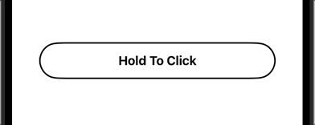

# HoldToClickButton

A SwiftUI view that triggers a click after holding it for a set amount of time

 




## Example

```swift
HoldToClickButton(
    label: {
        Text("Hold To Click")
            .fontWeight(.bold)
            .foregroundColor(.black)
    },
    onHoldEnd: {
        // Do something when clicked
    }
)
```

The following optional parameters are available

```swift
HoldToClickButton(
    fillColor: Color = Color.orange,
    borderColor: Color = Color.black,
    borderWidth: CGFloat = 2.0,
    holdDuration: TimeInterval = 1.5,
    cancelDuration: TimeInterval = 0.3,
    label: @escaping () -> Label,
    onHoldBegin: (() -> Void)? = nil,
    onHoldEnd: (() -> Void)? = nil,
    onHoldCancel: (() -> Void)? = nil
)
```

## Requirements
- Swift >= 5.7
- iOS >= 14
- macOS >= 13
- watchOS >= 7

## Installation

### Swift Package Manager

HoldToClickButton is available as a Swift package.

### Manual

Include `HoldToClickButton.swift` in your project

## License

HoldToClickButton is available under the MIT license. See `LICENSE` for more info.
